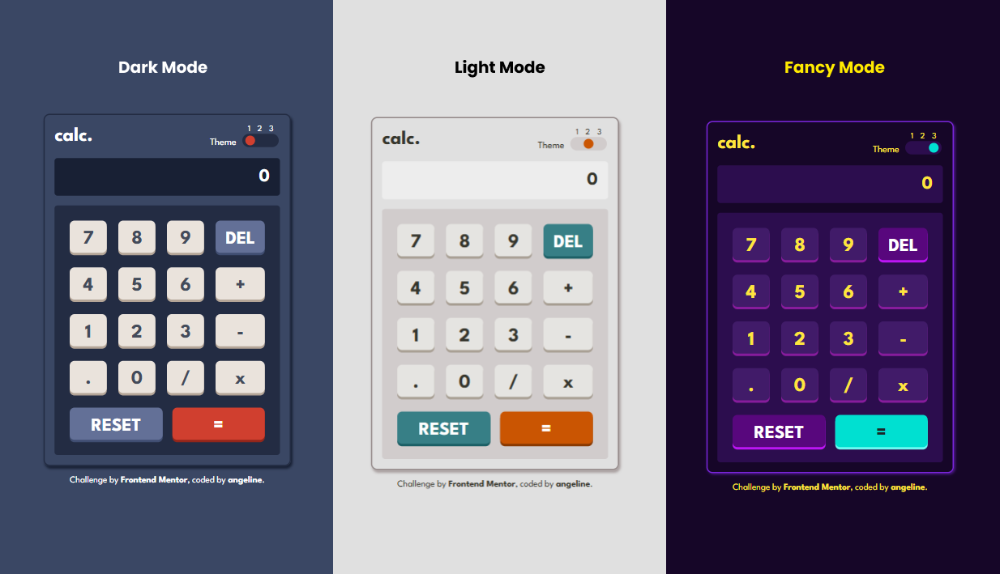

# Frontend Mentor - Calculator app solution

This is a solution to the [Calculator app challenge on Frontend Mentor](https://www.frontendmentor.io/challenges/calculator-app-9lteq5N29). **The goal of this project was to build a functional calculator app with responsive design and theme customization.**

## Table of contents

- [Overview](#overview)
  - [The challenge](#the-challenge)
  - [Screenshot](#screenshot)
  - [Built with](#built-with)
  - [Links](#links)
- [Other](#other)

## Overview

This calculator app features a sleek design and allows users to perform basic arithmetic operations while switching between multiple color themes. The app is responsive, adapting seamlessly to different screen sizes. It uses modern web development practices and is optimized for both desktop and mobile devices.

### The challenge

Users should be able to:

- See the size of the elements adjust based on their device's screen size
- Perform mathmatical operations like addition, subtraction, multiplication, and division
- Adjust the color theme based on their preference
- **Additional**: Have their initial theme preference checked using `prefers-color-scheme` and have any additional changes saved in the browser

### Screenshot

### Built with

- Semantic HTML5 markup
- CSS custom properties
- JavaScript
- Flexbox
- CSS Grid
- Mobile-first workflow

### Links

- Live Site URL: [https://angelineds.github.io/calculator-app/](https://angelineds.github.io/calculator-app/)

## Other

Other Projects:
- Portfolio Website - [angeline-portfolio.netlify.app](https://angeline-portfolio.netlify.app)
